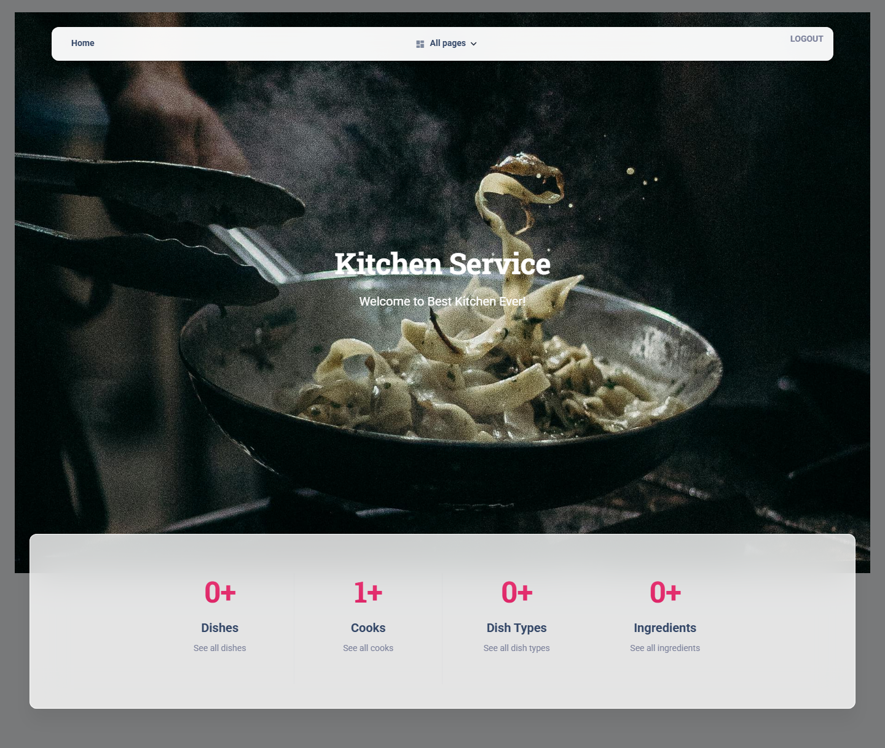

# Kitchen Service
Django project for managing a kitchen and its resources. 
The project allows you to organize dishes, ingredients and cooks, 
simplifying the workflow.

## Check it out!

[Kitchen Service project deployed to Render](https://kitchen-service.render.com/)

## Tests User Credentials

You can log in to the application using the following test account:
* **Username:** user
* **Password:** user12345


## Installation

```shell
git clone https://github.com/borunov65/kitchen-service
cd kitchen-service
python3 -m venv venv
source venv/bin/activate
pip install -r requirements.txt
python manage.py runserver # starts Django Server
```

## Features

Can perform the following functions:
* User authentication (login/register).
* CRUD operations for:
Dish types,
Dishes,
Ingredients,
Cooks.
* Search and filter by dish name or cooks name.
* Assign cooks to dishes.
* Intuitive interface based on Bootstrap.

## Demo


